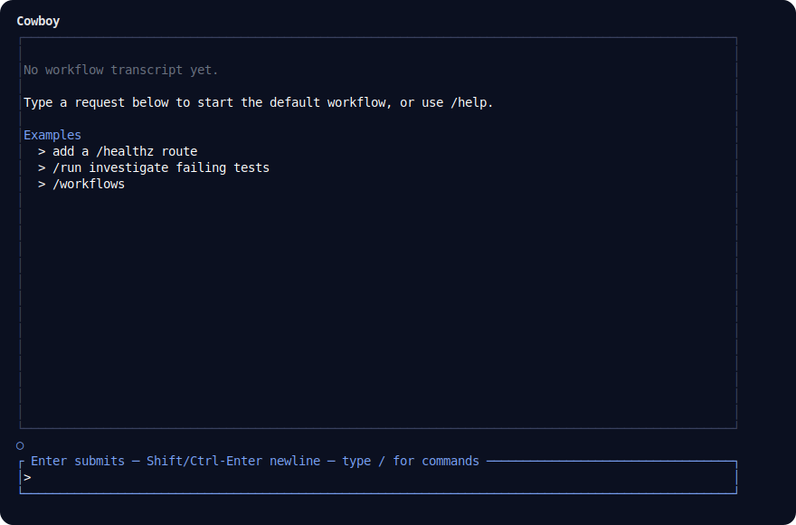

# Cowboy

Cowboy is a workflow-first terminal AI agent orchestrator for ACP-compatible coding agents.

It has one binary with two interfaces:

- `cowboy` launches the interactive terminal UI.
- `cowboy <subcommand>` runs non-interactive CLI commands against the same workflow runtime and persisted state.

Workflows are Lua files. A workflow step can run an agent, return a status, request input, or fail. Waiting input stores a durable resume descriptor so answers can continue through the same runtime path as other actions. Runs, step outputs, agent turns, role sessions, source snapshots, and event logs are persisted so the TUI and CLI see the same state.

## Project status

Cowboy is an early developer-preview project.

Current capabilities:

- Lua-authored workflow graphs with status-based transitions.
- Built-in default developer workflow plus user/project workflow directories.
- ACP-backed agent execution through commands such as `copilot --acp`, `claude --acp`, or `omp acp`.
- Reused backend agent sessions per `(run_id, role_id)`.
- Redb-backed run store with content-addressed source, step, and turn objects.
- TUI event transcript for workflow lifecycle, prompts, agent thinking/responses, and tool calls.

## Requirements

- Rust `1.85` or newer.
- An authenticated ACP-compatible coding-agent CLI on `PATH`.
- Cargo and Git access to this repository.

## Install

Install from GitHub:

```bash
cargo install --git https://github.com/syndim/cowboy.git cowboy
```

For local development:

```bash
cargo build
cargo run                              # launch TUI
cargo run -- run add a /healthz route  # start a workflow from CLI
cargo run -- runs                      # list workflow runs
```

## Quick start

Start the TUI:

```bash
cowboy
```

Start a workflow run from the CLI. Add `--workflow <workflow-id>` to bypass
agent-backed selection and run the catalog id shown by `/workflows` or other
catalog listings.

```bash
cowboy run add a /healthz route
cowboy run --workflow <workflow-id> add a /healthz route
```

List existing runs:

```bash
cowboy runs
```

Execute one additional step for a run, or continue it until it blocks, fails, or completes:

```bash
cowboy step <run-id>
cowboy resume <run-id>
```

Answer a waiting prompt:

```bash
cowboy answer <run-id> <prompt-id> <answer>
```

Ask Cowboy to summarize and apply workflow-file improvements from a completed run:

```bash
cowboy improve <run-id>
```

Resolve a failed run. A run gives up as `Failed` only after exhausting the
recoverable-retry budget; its failed step stays current. `cowboy resume` and
`cowboy step` retry that retained current step (`resume` continues until the run
blocks, fails, or completes; `step` takes one fresh attempt), which grants one
fresh initial attempt that can succeed or deterministically re-fail if the step
budget is still exhausted. Use `cowboy resolve` instead to force a manual status
rather than retrying the failed work. Without a `<status>`, this lists the
statuses the failed step can be resolved to along with the fields each requires:

```bash
cowboy resolve <run-id>
cowboy resolve <run-id> <status> [--field <name> <value>]... [--body <text>]
```

Repeat `--field` for each output field. Field names are exact and may include
spaces, `=`, or a leading `-`; quote them when needed. Ordinary values are
strings, while valid JSON literals retain their types:

```bash
cowboy resolve <run-id> planned --field summary "manual resolution" --field retry false --field files '["src/a.rs"]'
```

Recoverable step failures (for example, an agent reply missing its YAML
frontmatter, or a transient backend error) consume both the run-wide
`max_retries_per_run` budget and the current step id's cumulative
`max_retries_per_step` budget. Initial attempts do not count as retries, and
retries do not consume step or visit budgets.

## TUI



Plain text submitted in the composer starts a workflow run. When a workflow is waiting for input, typing the answer directly submits it to the pending prompt; `/answer` remains available for explicit answers.

### TUI commands

```text
/run [--step] [--workflow <workflow-id>] <request>  start a workflow run
/step <run-id>                                    execute exactly one more step
/resume <run-id>                                  continue a run until blocked
/answer <run-id> <prompt-id> <answer>             answer a waiting prompt explicitly
/runs                                             list workflow runs
/workflows                                        list known workflows
/improve <run-id>                                 improve workflow source from a run
/resolve <run-id>                                 list statuses a failed run can resolve to
/resolve <run-id> <status> [--field <name> <value>]... [--body <text>]  resolve a failed step and continue the run
/cancel                                           cancel active background tasks
/help                                             show built-in commands
/exit                                             quit Cowboy
```

`step` advances exactly one workflow step. `resume` keeps executing a running workflow until it waits for input, fails, suspends, or completes. Both also re-execute the retained current step of any non-terminal run — `Running`, `Failed` (for example one that gave up after exhausting its recoverable-retry budget), and `WaitingForInput`: `step` takes one fresh attempt and `resume` continues until the run blocks, fails, or completes. Re-executing a `WaitingForInput` run re-prompts its retained `ask_user` step and safely replaces the durable pending callback. Only `Completed` and `Cancelled` runs are non-resumable no-ops and left unchanged; `answer` remains the way to supply a prompt answer.

`/run --workflow <workflow-id> <request>` uses the catalog workflow id shown by `/workflows`, not necessarily the name declared inside a Lua workflow file.

### TUI keys

| Key | Action |
| --- | --- |
| `Enter` | Submit current input. |
| `Shift+Enter` / `Ctrl+Enter` | Insert a newline in the input. |
| `Tab` | Complete the first slash-command suggestion. |
| `↑` / `↓` | Browse command history. |
| `←` / `→` | Move the input cursor. |
| `Ctrl+←` / `Ctrl+→` | Move the input cursor by word. |
| `Ctrl+U` / `Ctrl+D` | Scroll the transcript. |
| `End` | Follow the latest transcript entry. |
| `Ctrl+C` | Quit Cowboy. |
| `Esc` | Cancel active background tasks. |
| `Backspace` / `Delete` | Delete before or at the input cursor. |

## Configuration

Default config path:

```text
${XDG_CONFIG_HOME:-~/.config}/cowboy/config.toml
```

If no config exists, Cowboy uses defaults:

- state dir: `${XDG_STATE_HOME:-~/.local/state}/cowboy`
- workflow store: `${XDG_STATE_HOME:-~/.local/state}/cowboy/workflow.redb`
- agent command: `copilot --acp`
- user workflows: `${XDG_CONFIG_HOME:-~/.config}/cowboy/workflows`

Example config:

```toml
state_dir = "~/.local/state/cowboy"
workflow_store = "~/.local/state/cowboy/workflow.redb"
workflow_dirs = [".cowboy/workflows", "~/.config/cowboy/workflows"]

[config_sets.default]
max_steps_per_run = 100
max_visits_per_step = 20
max_retries_per_run = 200
max_retries_per_step = 2

[config_sets.careful]
# Omitted fields independently inherit 100, 20, 200, and 2.
max_retries_per_run = 20
max_retries_per_step = 4

[[agents]]
name = "default"
command = "copilot"
args = ["--acp"]

[agents.model]
id = "opus-4.8-1m"
provider = "github-copilot"

[[agents]]
name = "reviewer"
command = "copilot"
args = ["--acp"]

[agents.model]
id = "gpt-5.5-1m"
provider = "github-copilot"
```

Every config-set field is optional and defaults independently to the values
shown above. The built-in `default` set always exists, even when the file only
declares custom sets. Set either retry limit to `0` to disable that retry
scope; `max_steps_per_run` and `max_visits_per_step` must be greater than zero.
Blank set names and unknown fields are rejected.

Workflows select a set with
`workflow(name, head, { config_set = "careful" })`; omission selects `default`.
An unknown selection fails before the new run is persisted. Cowboy snapshots
the selected name and all four effective limits into the run, so resume, step,
answer, resolve, and resolution-option operations keep working after runtime
configuration changes or removal. Retry counters are durable and cumulative
across visits to the same step id. Retry events retain visit-local attempt
numbers (`2..=max_attempts`) and use one fixed `max_attempts` for that visit.

This is a clean cutover: old top-level `max_steps_per_run`,
`max_visits_per_step`, and `max_retries_per_step` keys are rejected. Move them
under `[config_sets.default]`.

Any ACP-compatible coding-agent CLI can be used by changing an `[[agents]]` entry's `command` and `args`. Roles may select a named agent with `agent = "name"`.

## Workflows

Cowboy always includes a built-in default developer workflow. Custom workflows are optional and live as `.lua` files under configured `workflow_dirs`.

Copy starter workflows from `examples/workflows` into a configured workflow directory:

```bash
mkdir -p ~/.config/cowboy/workflows
cp -R examples/workflows/* ~/.config/cowboy/workflows/
```

The starter set includes `feature`, `bugfix`, and `dev-loop`. The `dev-loop`
workflow treats the run request as the Goal, asks the user for the exact
validation method, and creates a per-request `docs/plans/<snake_case_summary>/`
folder containing the implementation plan at `plan.md` and the validation guide
at `validation.md`, with ordered checks, evidence requirements, and explicit exit
criteria. Its validator must complete that guide before the loop can finish.
Across all three starter workflows, blocked agent steps first go to a dedicated
blocker reviewer; recoverable blockers return to the originating step with
agent-side recovery instructions, and only blockers requiring external input
prompt the user. After copying the examples, start dev-loop with
`cowboy run --workflow workflows/dev-loop <goal>`.

Read [Workflow authoring](docs/workflow-authoring.md) for the Lua API, runtime context, step actions, transitions, imports, examples, and debugging tools.

## Persistence and logs

Cowboy stores runtime state under `state_dir`:

```text
workflow.redb                    # runs, heads, immutable source/step/turn objects, role sessions
events/<run-id>.json             # persisted workflow event log for display/debugging
logs/cowboy.<YYYY-MM-DD>.<pid>.log  # diagnostic log per process and UTC date
```

Logging defaults to `info`. Set `COWBOY_LOG` or `RUST_LOG` for more detail, for example:

```bash
COWBOY_LOG="info,cowboy_agent_acp=debug" cowboy
```

## How it works

```text
CLI/TUI request
  -> workflow catalog selects a Lua workflow
  -> Lua source is snapshotted and compiled into a WorkflowDefinition
  -> engine resolves config_set (or default) and snapshots effective limits
  -> WorkflowRun is persisted through redb
  -> WorkflowRunner executes steps until completed/failed/waiting
  -> agent steps go through ACP and parse YAML-frontmatter output
  -> workflow events are emitted and persisted for UI/CLI display
```

## Development

Run tests:

```bash
cargo test
```

Build diagnostic test apps:

```bash
just test-apps
```

The helper binaries are copied into `target/debug/test-apps`:

- `workflow-chart`
- `store-cli`
- `execute-agent`
- `acp-chat`
- `catalog-cli`
- `engine-cli`

Live ACP integration tests require an authenticated backend CLI:

```bash
just acp-test copilot
just acp-test omp
```

## Documentation

- [Workflow authoring](docs/workflow-authoring.md) — Lua workflow authoring reference.
- [Architecture](docs/architecture.md) — Runtime model and data flow.
- [Module map](docs/module-map.md) — Workspace crate responsibilities and seams.
- [AGENTS.md](AGENTS.md) — Repository guide for AI coding agents.

## Inspiration

Cowboy is inspired by [United Workforce](https://github.com/shazhou-ww/united-workforce), a stateless workflow engine for multi-agent orchestration.

## License

Cowboy is licensed under the [MIT License](LICENSE).

